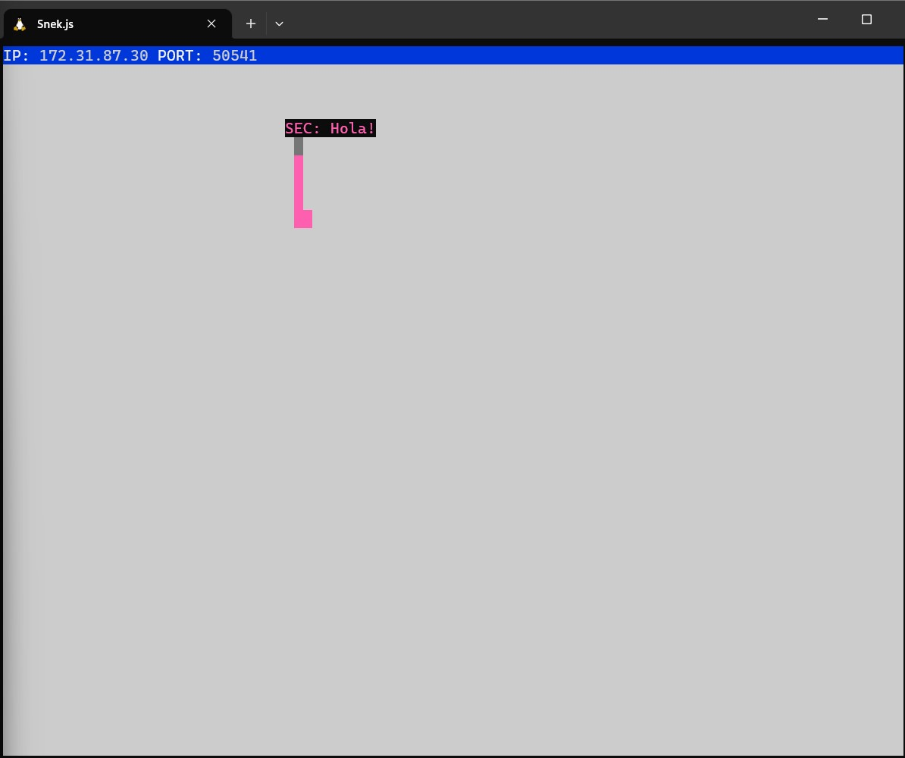
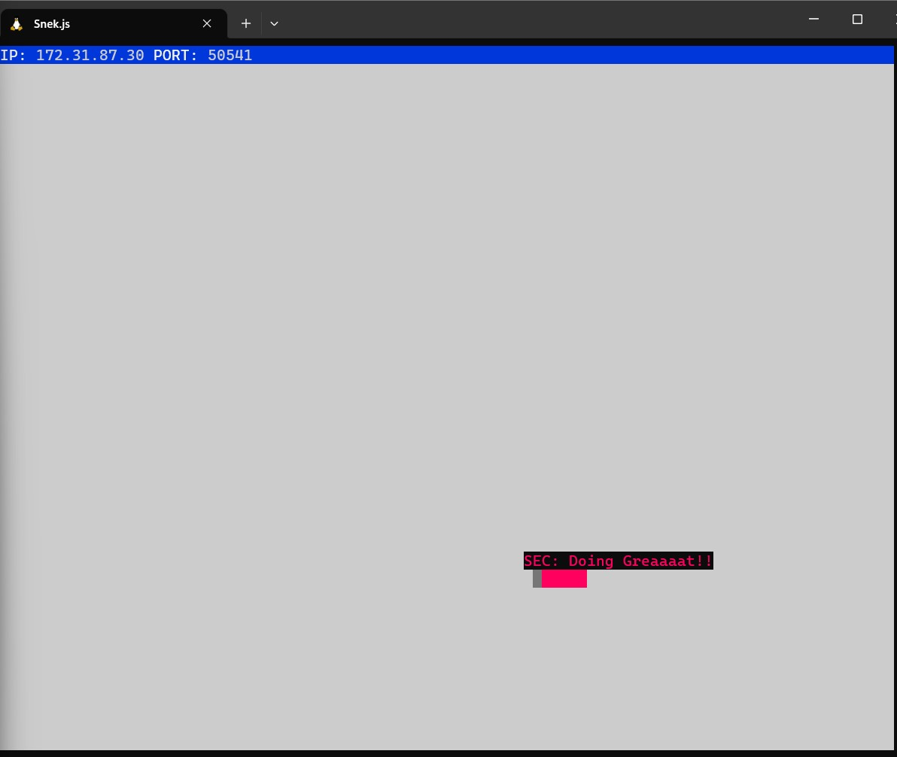

Module 2: Week 5
46.875% Complete
47% Complete
Submit Project For Evaluation
Note
60 minutes
Status
Incomplete
This activity will guide you through the project submission process for Snake.

If you're planning on working on any stretch goals or extra features for your project, do still complete this activity now. You may find you're missing functional requirements, or you may find some bugs that need fixing, so to avoid a last-minute scramble when submitting your project we suggest you get this done before you work on stretch.

Step 1: Verify the project is complete
At the end of this activity (which may take some time to finish if you find any problems during this submission process) you'll be submitting Snake for evaluation. Your project will be rejected if it does not meet all the major functional requirements, so it's important that you double-check you've fulfilled them all. If your project has not fulfilled the minor functional requirements it will not be rejected, but it's nevertheless a good idea to get as many of them completed as possible.

Instruction
Make sure you've fulfilled all the major functional requirements for Snake.

A good approach could be to test each requirement in your app, one by one, keeping a list of any problems or bugs you find.

Instruction
If you've discovered that you're missing (major) functional requirements, or if you've found any major bugs, fix them then re-test your app.

It's alright if minor bugs are still present in your app (or if they're found by a mentor while evaluating), but keep in mind that if any major bugs are found your project may be rejected. Test thoroughly!

You can see all the functional requirements on the Snake Project Description Page. Note that all requirements listed are "Major", unless marked as "Minor" or "Stretch".

Step 2: Clean up the code
Instruction
After you've confirmed that your project is indeed complete and working correctly, take some time to clean up your code.

Besides checking for completeness and correctness, your mentors will also evaluate whether your code follows best practices and has a clear and consistent style. Some of what they'll be looking for:

Correct variable declaration and semi-colon use
Proper and consistent indentation and spacing
Clear and consistent function and variable names
Modular and reusable code (no need to break your code into Node modules, but using helper functions to keep the code DRY is a good idea)
Well-commented code (in other words, that your code is easy to read)
That no debugging, commented-out or dead/un-used code is present
Sensible structure for the project's files and directories
Step 3: Add/update README file
In just a few weeks you'll be sharing your GitHub profile with prospective employers. They'll be looking at your work, including your big projects like this one, and to impress them you're going to add a README file to this project, and in the next step also some screenshots!

Instruction
If your project doesn't already have a README.md file, create a file called README.md in the root project/repo directory.

Most GitHub repos have a README.md in the main repo directory, which provides some details about the project directly below the file and directory structure view. It is rendered as HTML. Here's a screenshot of this, as an example.

"README.md example"

Good README files usually include a title of the project, a brief description, the project's dependencies and any necessary setup steps to get the project running.

Instruction
To get you started, add the following Markdown-formatted text to your README.md file.

# Snake Client Project

Snake game is a very popular video game. It is a video game concept where the player maneuvers a dot and grows it by ‘eating’ pieces of food. As it moves and eats, it grows and the growing snake becomes an obstacle to smooth maneuvers. The goal is to grow it to become as big as possible without bumping into the side walls, or bumping into itself, upon which it dies.

This is simply a multiplayer take on the genre.

Before you can run this client, you will need to be running the server side which you can download and install from here.

## Final Product

## Getting Started

- Follow steps inside the snek server repo to run the server side
- Run the development snake client using the `node play.js` command.
